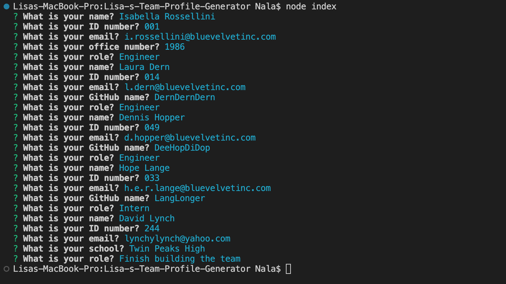
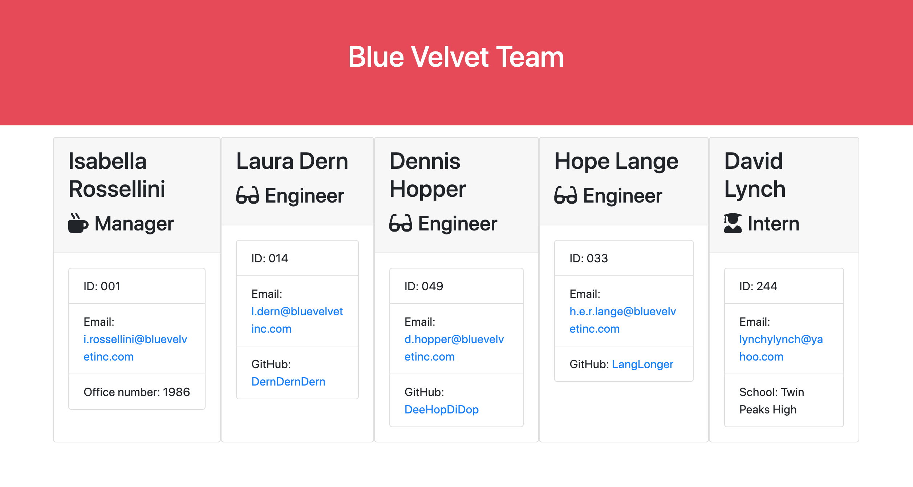

# Lisa's Team Profile Generator

[](https://opensource.org/licenses/MIT)<br>

This application will take in information about employees on a software engineering team, then generate an HTML webpage that displays summaries for each person.

## Table of contents
1. [Getting Started](#toc-gettingstarted)
2. [Summary](#toc-summary)
3. [App Description](#toc-appdescription)
4. [Usage](#toc-usage)
5. [License](#toc-license)
6. [Collaborators](#toc-collaborators)
7. [Contribute](#toc-contribute)
8. [Tests](#toc-tests)
8. [FAQ](#toc-faq)
10. [Contact](#toc-contact)


## Getting Started <a name="toc-gettingstarted"></a>
To use this program, you will need to have Node.js and Inquirer 6.5.0 installed. You can download Node.js from the official website and install Inquirer by running the following command in your terminal:

```javascript
npm i inquirer@6.5.0
```

It is also recommended that you use Jest for running any tests when improving and altering the code as a collaborator/contributor. Once you have these dependencies installed, you can run the program in your VS Code Terminal.

## Summary Description <a name="toc-summary"></a>
This program will help you to write a HTML page containing cards with details about your team. The prompts it generates in the VS Code terminal make sure that you create a consistent outcome with essential information about your colleagues. You start as the manager and have the option of either adding engineer team members or interns. I hope you find it useful!


## User Story

### As a manager:

- I want to use a template via the VS Code Terminal for creating a HTML file
- So that I can have an overview of my team and their details such as email and GitHub profile


# App description <a name="toc-appdescription"></a>

This program can be used via the VS Code Terminal to create a HTML file for your team. It uses prompts to ask you for the necessary information.

## Who is the target audience?

This program is suitable for anyone who wants to create an overview of their team. It's particularly useful for new managers with larger teams or who are new to their role to get an overview.

## What is the problem that it addresses?

Creating consistent and comprehensive records of a team can be a challenge, especially for new managers. Storing information in data sheets like Excel is not visually appealing and hard to gather information from at one glance.

## How does the product solve that problem?

This program addresses these issues by providing tailored prompts that guide you through the process of creating cards for each team member. The prompts ensure that you don't forget any essential information and streamline the content of your team list.

## JavaScript (HTML, CSS)
The program runs in VS Code and creates a new HTML file based on user input. Example CSS is included for styling (this had been provided by course instructor Dan Muller) - and can be adjusted as the user likes. Javascript is powering this application, runs tests on each input type and adds user input from the terminal (prompts).

# Usage <a name="toc-usage"></a>

Use the following command in your VS Code terminal to get started with receiving the prompts:

```javascript
node index
```

Check out my [GitHub Repo](https://github.com/LisaMLorenz/Lisa-s-Team-Generator) to see the required code and have a look at this deployed page to see an example of the [Blue Velvet Team](https://github.com/LisaMLorenz/Lisa-s-Team-Generator/index.html).


Here are a few more screenshots to illustrate how to get started. Make sure to use `node index` in the terminal to start the process.



This is how your terminal prompts should look. Remember that you can make adjustments to change or add prompts.



Here's a screenshot of a possible deployed page.


## This is what the app should do:

* Accepts user input via the command line.
* When a user is prompted for information, a team.html file is created with cards for each team member.


## License <a name="toc-license"></a>

This project is licensed under the MIT license. Feel free to edit, share and comment. I hope this will benefit your projects.

## Collaborators <a name="toc-collaborate"></a>

For now it's just - [Lisa Lorenz](https://github.com/LisaMLorenz). We are looking forward to welcome contributors though.

## How to Contribute <a name="toc-contribute"></a>
If you would like to contribute to this project, please follow these steps:

1. Fork the repository.
2. Create a new branch.
3. Make your changes and commit them.
4. Push your changes to your fork.
5. Submit a pull request.

## Tests <a name="toc-tests"></a>

This application was thoroughly tested to ensure that it performs as expected and without any bugs. The testing was conducted using the VS Code Terminal with Node.js and Inquirer.js installed.

To test the application, we ran multiple scenarios in which we input different values in response to the prompts generated by the application. We also tested the application with different combinations of inputs to verify that it handles all cases correctly.

During testing, we didn't encounter any issues or errors. The application performed smoothly, generating a high-quality README file with all the required sections and information.

If you encounter any issues or bugs while using the application, please don't hesitate to report them by opening an issue in the GitHub repository. We'll do our best to address them promptly.

## FAQ <a name="toc-faq"></a>

1. What if I don't want to prompt for different information?
- You can simply adjust the lib files for each team member.
2. What if I want to add a new type of team member that's not included in the list of options?
- You can manually add copy the code and duplicate it with edits. The code is written in a pure way, so it should be easy for you to add and adjust.
3. Can I customize the prompts for my specific team needs?
- Yes, you can modify the prompts in the code to suit your team requirements.
4. Can I use this program for projects other than Node.js projects?
- No, this program is specifically designed to work with Node.js projects and requires Node and Inquirer 6.5.0 to be installed.
5. Can I contribute to this project?
- Yes, contributions are welcome! Please refer to the "How to Contribute" section in the README for more information.

## Any more questions? <a name="toc-contact"></a>

Please get in touch via [GitHub](https://github.com/LisaMLorenz) or contact me directly via hej@frau-lorenz.de.

